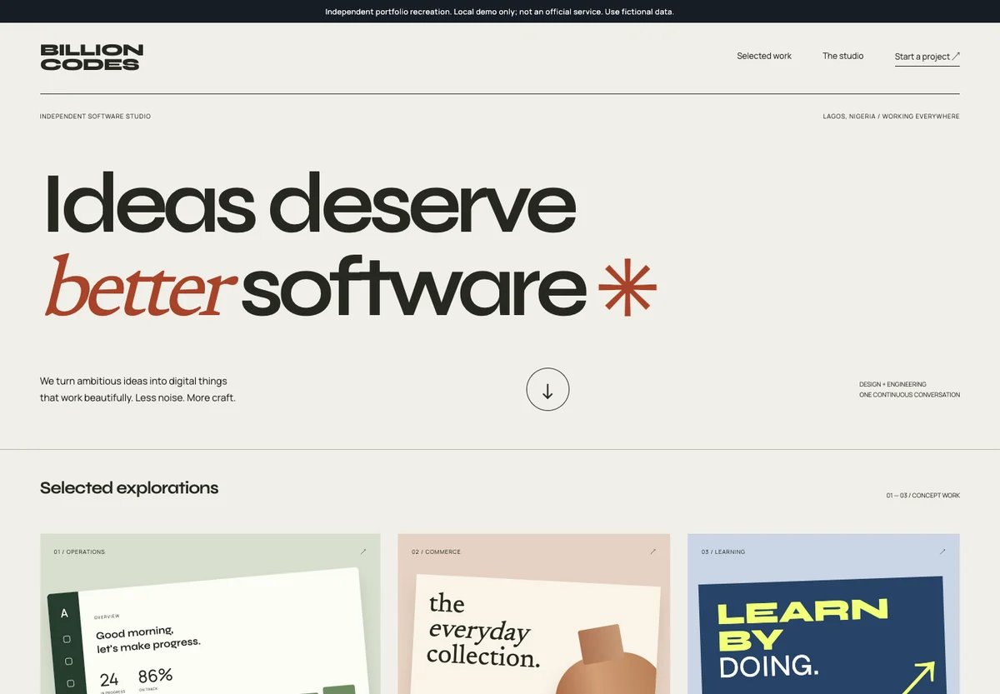

# Billioncodes Studio

An editorial software studio showcase with an interactive project estimator and saved briefs.

A new independent portfolio implementation by Josiah Adeyemo. Not recovered source, not an official company website, and not affiliated with any referenced brand. All records, inventory, prices and scenarios are synthetic.

## Run

Requires Node.js 22.16+ (built-in SQLite). No package installation required.

```sh
npm start
```

Open http://127.0.0.1:5203. `PORT` and `DATABASE` may override the defaults. Data persists in `data/workspace.sqlite` (ignored by git).

## Verify

```sh
npm run check
npm test
```

Tests exercise domain actions, persistence across restarts, CSRF, request limits, untrusted hosts and static-file isolation. Desktop/mobile browser coverage lives in the parent showcase QA workspace.

## Boundaries

This is a loopback-only, single-operator demo, not a production service. It intentionally has no public account system. Do not expose it through a tunnel or deploy it publicly without authentication, per-user authorization, HTTPS, backups and operational controls. JSON writes require a CSRF token; cross-origin writes and untrusted Host headers are rejected. SQLite updates are atomic. Workspace collections are bounded.

No real messages, payments, policies, NFT mints, customer requests or rental deliveries are sent. Use fictional information only. The interface explicitly explains its simulation scope.

## Preview


