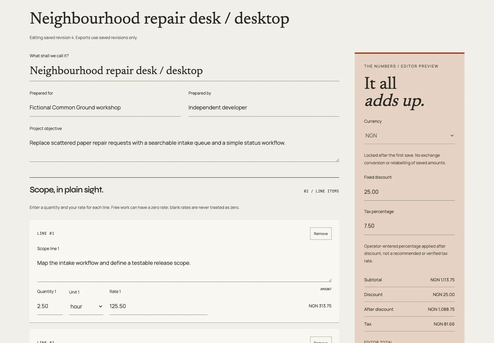
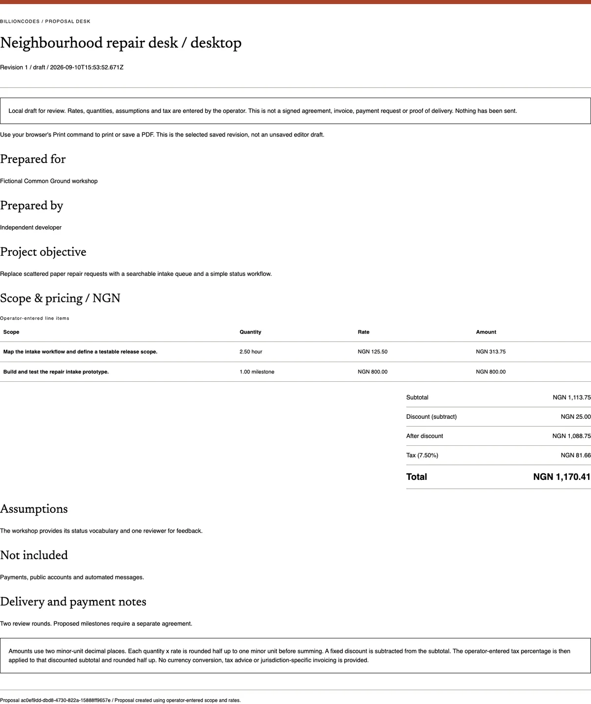

# Billioncodes Studio / The Proposal Desk

A private, single-operator scope and estimate workspace for freelancers and small studios. Replace a canned price calculator with **your own deliverables, quantities and rates**, explicit assumptions and a recoverable revision history. The existing cream/terracotta editorial identity, Syne/News typography and original interface studies are retained.

An independent portfolio implementation by Josiah Adeyemo. New source, not recovered code or an official third-party company service. Screenshots, legacy examples and test data are fictional; their prices are not suggested market rates.


## Run locally

Requires Node.js 22.16+ with built-in SQLite. No runtime package installation is needed. The pinned npm dependencies are development test tools only.

1. Create a local `.env` in this repository, using `.env.example` as the reference. Set `STUDIO_PASSWORD` to your own strong, unique password of at least 16 characters. Do not reuse a test password or commit `.env`.
2. Run `npm start` and open [the local proposal desk](http://127.0.0.1:5203/#start).
3. Unlock the desk, define your scope, enter your rates and save a proposal revision. Nothing is sent to a client.

An absent or empty password keeps saved proposals, legacy records and exports inaccessible. Short nonempty passwords fail startup. A process `STUDIO_PASSWORD` overrides the repository `.env` value. Restart after changing it; sessions expire after eight hours, explicit locking or a server restart. No default/shared credential is created.

`PORT` (default `5203`) and `DATABASE` (default `data/workspace.sqlite`) are process environment overrides. Only the password is read from `.env`. The server binds to `127.0.0.1`; do not expose it through a public tunnel.

## From scope to a reviewable proposal

- Enter a project objective, optional client/author references and up to 30 deliverable lines with quantity, unit and rate. Blank rates are invalid; zero is an explicit free rate.
- Use NGN, USD, GBP or EUR. Currency is locked after the first save. For another currency, start a new proposal and enter its rates; existing numbers are never silently relabelled or converted.
- Make assumptions, exclusions and proposed delivery/payment notes visible. Any tax percentage is entered by the operator, not supplied or verified by the app.
- Preview exact totals, save immutable revisions and compare old scope/rates/notes with the latest saved version, including the total-price difference. Server-derived totals and the calculation-rule identifier are stored with each revision.
- Export a selected saved revision as Markdown, JSON or a printable HTML proposal using the browser's Print / Save PDF command. Unsaved changes never leak into a saved-revision export.
- Archive without deleting history. Restore an earlier revision as a new draft. Search by project or client reference and filter active/archived documents.





Exports are review documents, **not signed agreements, invoices, payment requests or proof of delivery**. There is no email, client acceptance, signature, payment collection, tax filing or external provider integration.

## Arithmetic, explicitly

The browser and server share the same pricing implementation. Inputs are plain decimal strings, with at most two decimal places. Signs, grouping commas, exponent notation, extra precision, blanks and numeric coercion are rejected. Units are hours, days, items or milestones; they are descriptive and do not trigger hidden pricing multipliers.

1. Parse quantities into hundredths and rates into integer minor units.
2. Multiply using `BigInt`, then round each line **half up** to one minor unit before summing.
3. Subtract the fixed-amount discount. It cannot exceed the subtotal.
4. Apply the entered tax percentage to that discounted subtotal and round half up once more.
5. Add that tax amount to the discounted subtotal. Display all amounts with two decimal places and the explicit currency code.

Synthetic example, not a suggested rate: `2.50 x 125.50 + 1.00 x 800.00 = 1,113.75`; subtract `25.00`, then apply a user-entered `7.50%`. Tax rounds to `81.66`, total `1,170.41`. A `0.50 x 0.01` line rounds to `0.01` before summing. The same numerical input in another supported currency yields the same numerical amount, not an FX conversion.

Quantity range: `0.01-100,000.00`. Unit-rate range: `0.00-10,000,000.00`. Tax input: `0.00-100.00%`. Every line, subtotal and final total must remain at or below `1,000,000,000.00` currency units. The tax model is a single operator-entered percentage after discount; it is not jurisdiction-specific, does not implement tax-inclusive pricing or multiple taxes, and is not accounting/tax advice.

## Privacy, persistence and recovery

- SQLite transactions wrap edits, version checks, operation receipts and migration. A stale editor cannot replace a newer revision; the UI retains unsaved changes for review rather than silently merging prices.
- Ambiguous network responses can be retried with the same durable operation ID, including after restarting the server. Reusing an operation ID for a different payload fails. No-op saves do not add revisions or rewrite SQLite.
- Old fixed-price demo estimates migrate unchanged into a read-only legacy collection. They remain labelled fictional, can be exported as their original JSON records and cannot be edited into purported client proposals. Unknown original save dates are not invented.
- Limits: 200 new proposals, 50 revisions per proposal, 30 lines per proposal, 64 KiB per request and 10 MiB of serialized workspace data. Field limits apply server-side. The app never automatically deletes saved history to make room.
- The password gates one local workspace. There are **no individual accounts, client-level permissions, verified identities or approval roles**. Do not share this running workspace with untrusted users.
- Sessions use random tokens, HttpOnly/SameSite cookies, server-side expiry and rotated CSRF tokens. Writes have origin/host, JSON-size and bounded rate checks; static routes cannot expose server source, `.env` or the database. Exports escape untrusted text and omit operation receipts.
- The HTTP cookie is intentionally not `Secure` on loopback. This is not public/HTTPS hosting. Data is not encrypted at rest; an OS administrator can read the database or environment. Protect local file permissions and disk encryption. A public deployment needs a separate security and operations review.
- Unsaved drafts live only in this tab's memory, not localStorage. Re-authentication preserves the draft; explicit locking clears the editor, proposal list and rendered history. Closing/reloading an unsaved tab can lose work. There is no autosave, background delivery or cross-device sync.

**Backup / restore:** stop every process using this database before copying the complete `data/` directory to a private backup location. Keep `.env` separately and securely. To restore, stop all processes, preserve the current directory under another name, restore the full backed-up directory and restart the same app version. Test a backup with a separate `DATABASE` path before relying on it. Single-revision proposal JSON and legacy JSON downloads are not complete database backups and have no database-import endpoint. Automated backup tooling, a real-user trial and separate-user authorization remain future work.

## Verify

```sh
npm ci
npm run check
npm test
npx playwright install chromium
npm run test:e2e
```

For an installed Google Chrome: `PLAYWRIGHT_CHANNEL=chrome npm run test:e2e`.

The 21 core tests include 500 generated decimal cases checked against an independent integer oracle, half-up boundaries, input/amount bounds, currency locking, immutable stored totals, retry/concurrency protection, exact session expiry, authenticated exports, unchanged legacy migration, unsupported-format preservation, real SQLite rollback and storage limits. Eight desktop/mobile browser cases exercise the entire proposal/export/restore workflow, two-tab conflicts, lost responses, re-authentication, legacy isolation and decimal validation, with automated WCAG A/AA and horizontal-overflow checks.

Tests use isolated temporary SQLite databases and synthetic passwords; they never operate on the normal local workspace. Repository-owned browser tests run in GitHub CI alongside core tests. The checkout/setup actions are pinned to verified v6 commit IDs, using the [official checkout](https://github.com/actions/checkout) and [setup-node](https://github.com/actions/setup-node) repositories; the application runtime under test remains Node 22.

`UPDATE_SCREENSHOTS=1 PLAYWRIGHT_CHANNEL=chrome npm run test:e2e` records actual browser captures in ignored `docs/*.png`. README WebP images are optimized from those captures, not generated mockups. Automated tests do not replace manual assistive-technology checks, a real-user pilot or a production security review.
